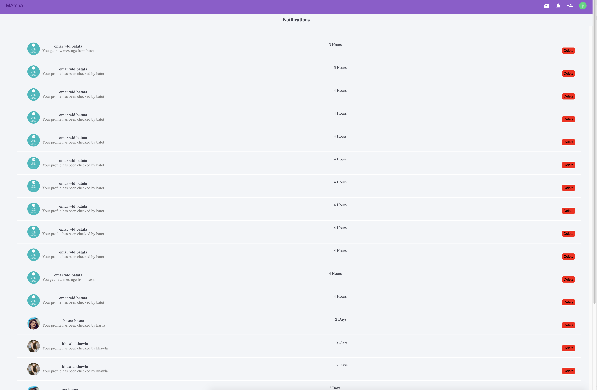

# Matcha
Ce projet vous propose de créer une application web permettant à un utilisateur de rechercher, filtrer (selon localisation, liste interet, age et rating )  et visionner des Profils  pour chater avec ils . le utilisateur ne pas faire aucun action sans photo de profil

### Stack

* Node JS (Express)
* React JS
* Material UI Front libraries
* MySQL
* JSON web tokens
* Axios for API requests

## Screenshots

 
 
 
 
 
 
 
 
 
 
 

## Subject

[Subject](Subject/english.subject_matcha_.pdf) 

## License
[MIT](https://choosealicense.com/licenses/mit/)
